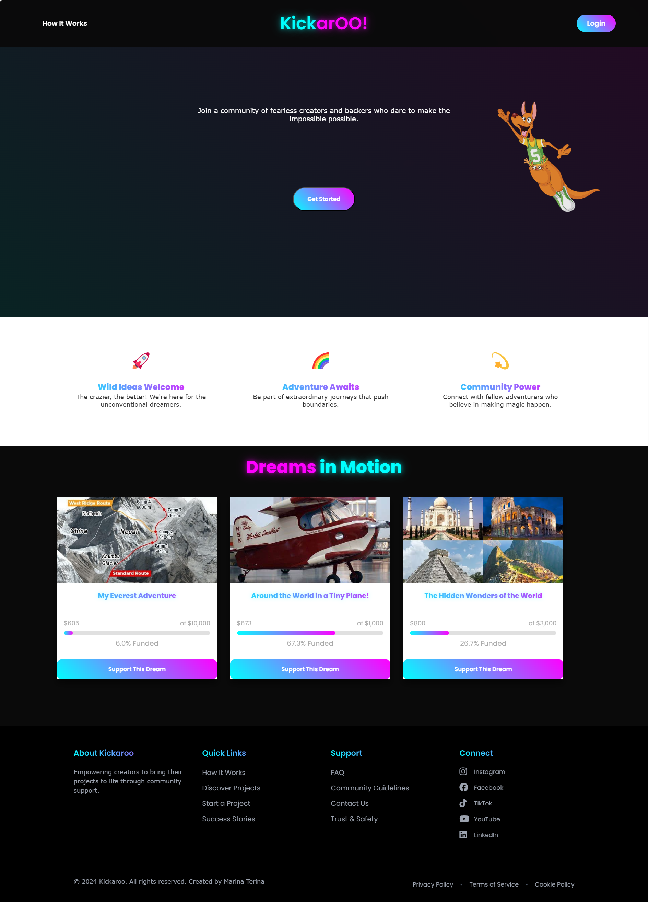
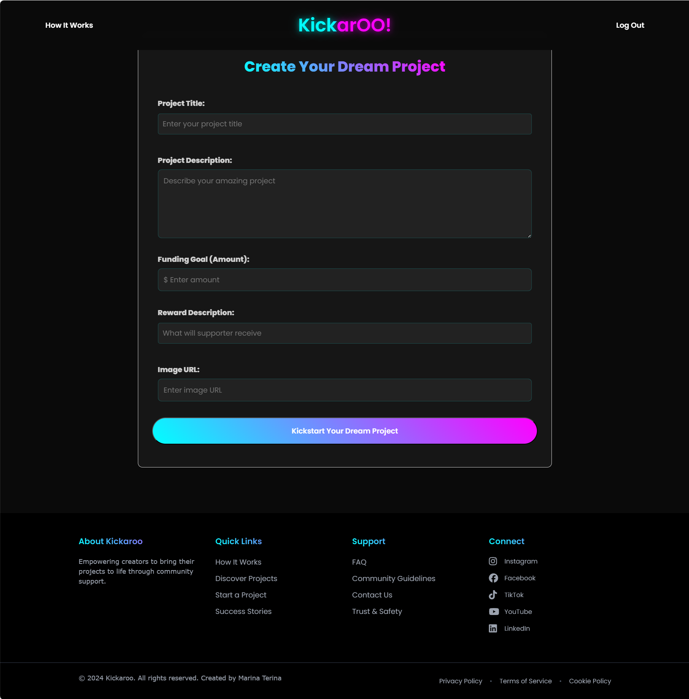
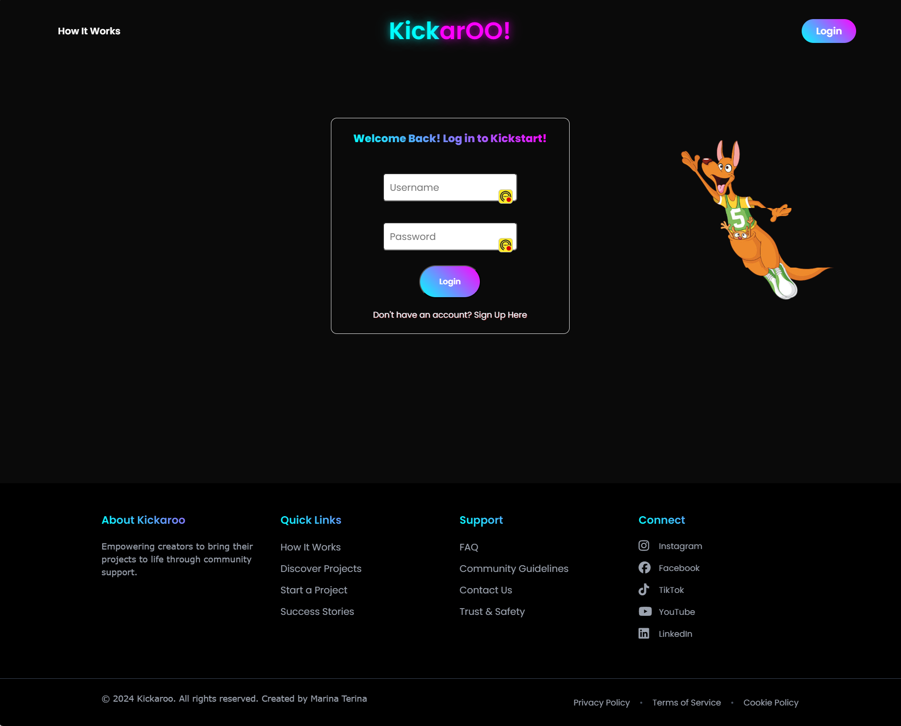
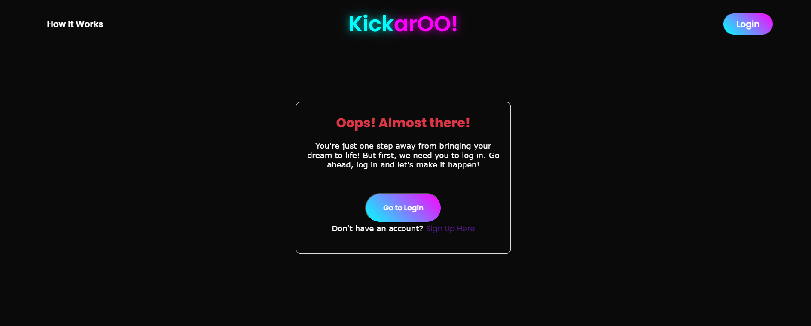
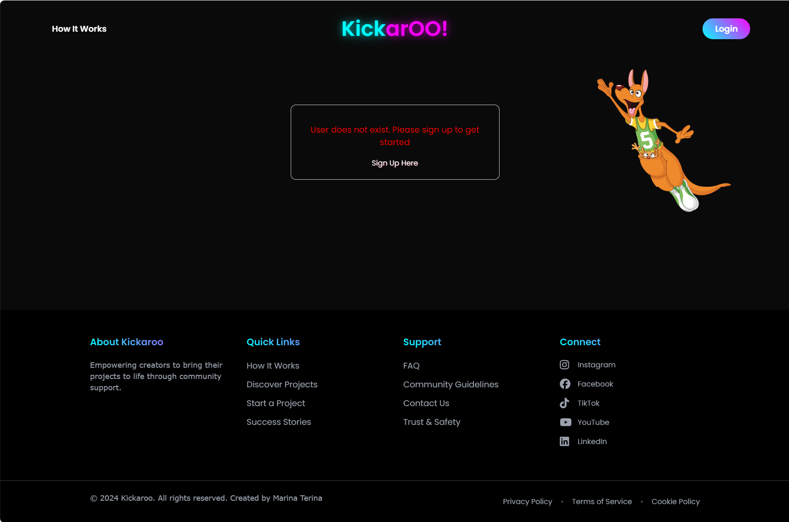
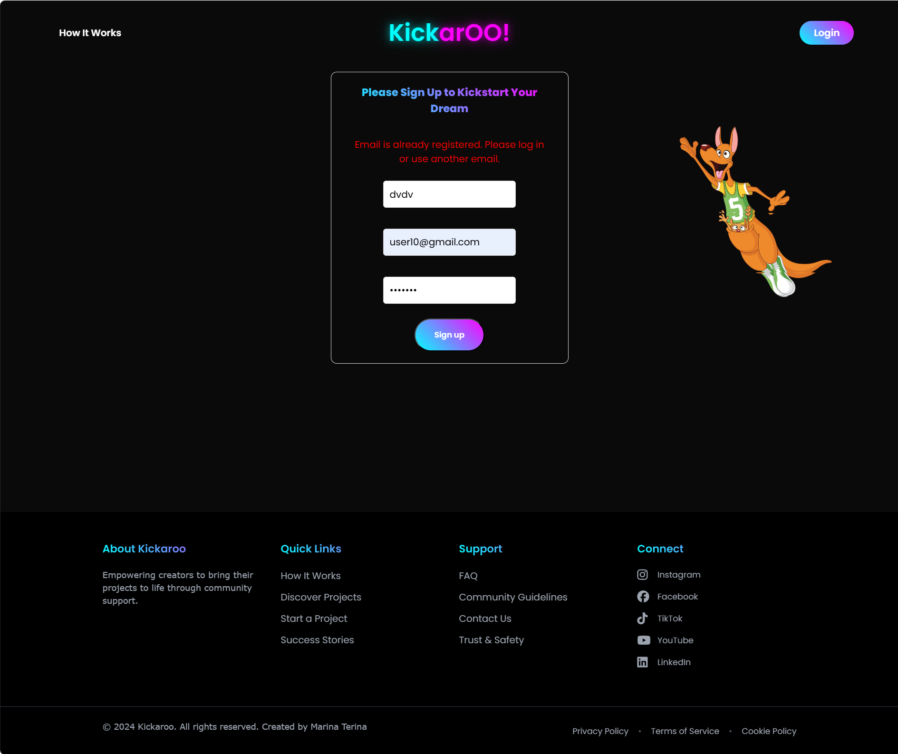
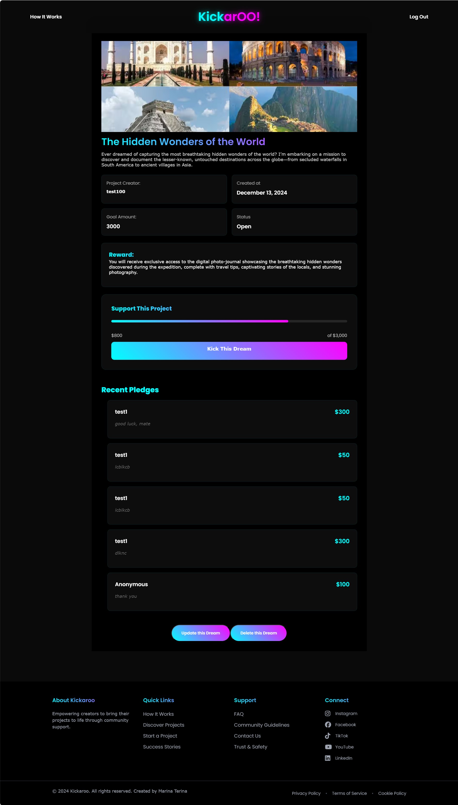
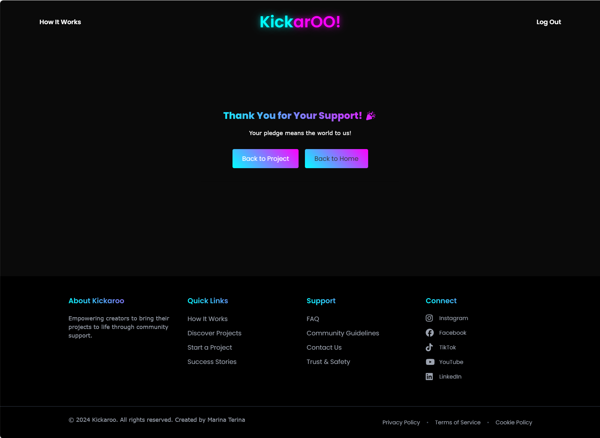

KICKAROO

### Concept/Name
Kickaroo is a crowdfunding platform designed to help people bring their wildest, most unconventional ideas to life. The platform appeals to adventurers who are ready to kickstart something crazy and unique. Backers get to support out-of-the-box projects while being an integral part of exciting and unconventional journeys. They will have the chance, for example, to receive exclusive offers, behind-the-scenes access, the opportunity to follow the journey, or early bird perks that allow them to enjoy rewards and products before they are available to the general public.

### Front End Pages/Functionality 
         1. Home Page functionality:
- Navbar and Login Button: For easy navigation to key sections and access to user accounts.
- Overview of Featured Projects: This section is designed to encourages users to explore projects 
  Each featured project will include: Title, Image, Target amount, and Button "Kick Me Mate!" 
- Call-to-Action Buttons for Creators: Prominent buttons "Kickstart Your Idea" inviting creators to start their projects.

         2. Login/Register Page functionality:
- User registration form for new users (Fields:Username, Email address, Password).
- Login form for returning users(Fields: Email address or username, Password).

          3. Project Creation page "Kickstart Your Idea":
- This page allows users to provide all necessary details to create a project. 
  Project details includes:
       *Title
       *Owner (a user)
       *Description
       *Image 
       *Target amount to fundraise
       *Status
       *Timestamp
       *Perks

         4. Pledge Creation Page "Kick Me Mate!":
- This page allows users to make pledges easily.  
  Pledge details includes:
        *Amount pledged
        *Option to make the pledge anonymous or not
        *A comment to accompany the pledge
        *Desire to receive a perks (if anonymous - no perks).

        5. User Dashboard: A page for users to view and manage their created projects and pledges - this section is in progress

## Submission Requirements

### User Account Requirements
- [x] Username
- [x] Email address
- [x] Password

### Project Requirements
- [x] Title
- [x] Owner (a user)
- [x] Description
- [x] Image
- [x] Target amount to fundraise
- [x] Open/Closed status for new supporters
- [x] Creation timestamp

### Pledge Requirements
- [x] Pledge amount
- [x] Project association
- [x] Supporter/user information
- [x] Anonymity option
- [x] Comment feature

### Technical Requirements
- [x] Implement update/delete functionality
- [x] Implement proper permissions
- [x] Return appropriate status codes for API requests
- [x] Handle failed requests gracefully
- [x] Use Token Authentication
- [x] Implement responsive design (in progress)

### Project Screenshots

#### Main Pages
- 
- 
- 
- 

#### Authentication & User Management
- 
- 

#### Authorization Messages
- 
- 
- 
- 

#### Project Management
- 
- 

#### Other
- 
- 
- 
- 

# React + Vite

This template provides a minimal setup to get React working in Vite with HMR and some ESLint rules.

Currently, two official plugins are available:

- [@vitejs/plugin-react](https://github.com/vitejs/vite-plugin-react/blob/main/packages/plugin-react/README.md) uses [Babel](https://babeljs.io/) for Fast Refresh
- [@vitejs/plugin-react-swc](https://github.com/vitejs/vite-plugin-react-swc) uses [SWC](https://swc.rs/) for Fast Refresh

